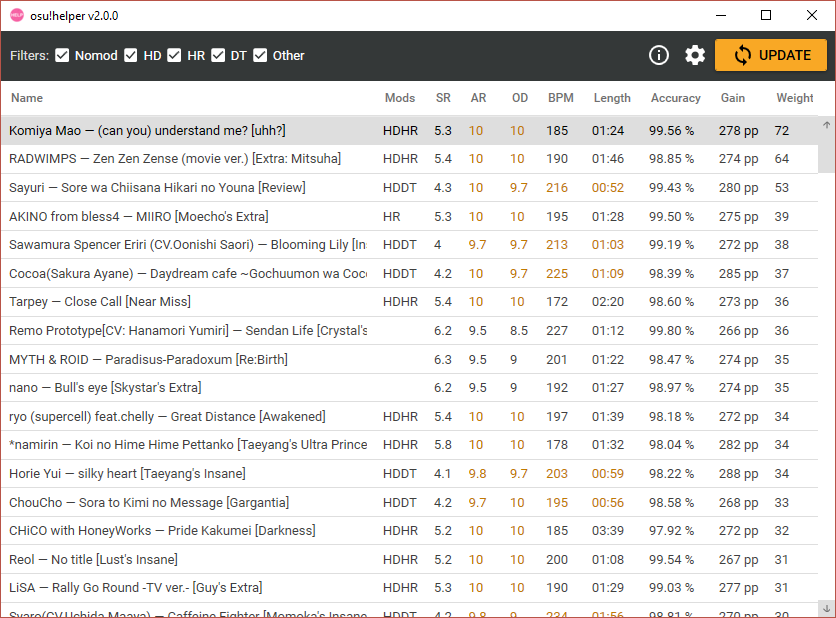
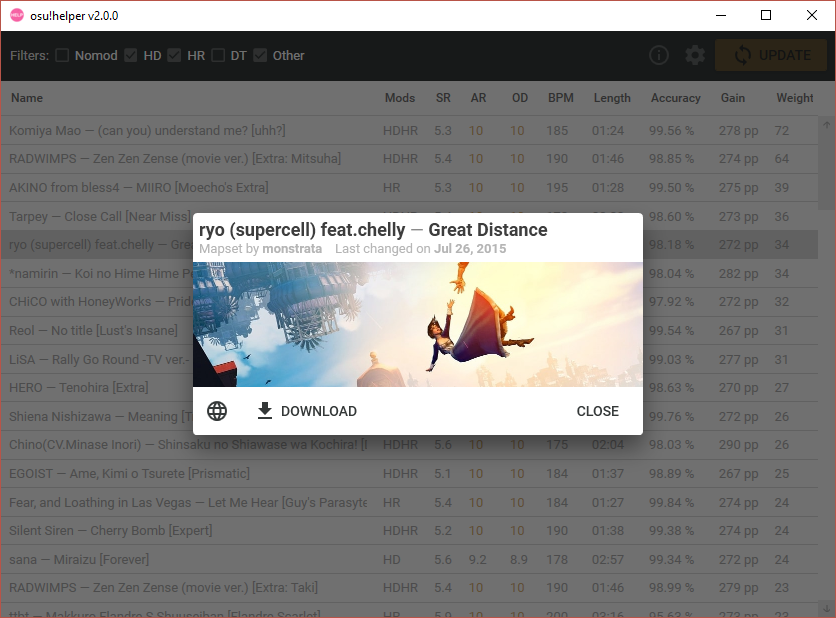

# osu!helper

osu!helper is an application that recommends beatmaps in osu! based on your current performance. It searches for players who did similarly well on maps you've played in the past and uses their top plays as basis for recommendation. The recommended maps are then displayed in a grid where users are able to see the map's attributes adjusted by the suggested mods, as well as some other useful information. Maps can also be previewed and downloaded straight from the application.

## Download

- **[Latest release](https://github.com/Tyrrrz/OsuHelper/releases/latest)**
- [CI build](https://github.com/Tyrrrz/OsuHelper/actions)

Note: This application requires .NET Core runtime for desktop apps, which you can [download here](https://dotnet.microsoft.com/download/dotnet-core/current/runtime).

## Features

- Get recommendations in large batches
- Filter results by mods
- Beatmap stats at a glance, adjusted by mods
- Recommendations are weighted by beatmap's statistical difficulty
- Download or preview beatmaps straight from application
- Supports all game modes

## Screenshots

